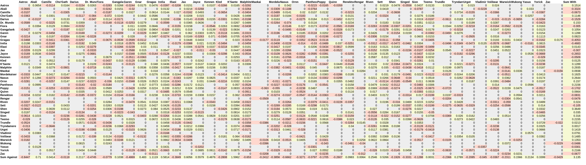

# LoL Matchup Optimizer

Experimental prototype to find the best combos (3 tricks) of champions to main on toplane.

> The entire project ist a very quick and dirty prototype with low code quality. It was written in about 2 hours to try out some ideas. I uploaded it here in case anyone else finds it useful. Please read the paragraph Limitations.

## Structure

The `downloader.py` script parses League of Graphs to get all good and bad picks for every toplane champion. The `converter.py` then saves the results into a csv file, which can be imported and edited in Excel.

The `interpret.ipynb` notebook allows you to enter any champion name and find the best combo of champs (3 trick). The best combo is one that is countered by the least amount of champions.

## Results

You can use this script as long as it works for the League of Graphs site. The csv file could be used in Excel to get an overview of all matchups. I included `output.ods` and `output.png` as examples on what it could look like (patch 13.14:



If you'd like to find the best combination of champs to main on toplane if you already play garen, the `interpret.ipynb` would give you the following recommendations:

```
These are your best 3-trick combos for Garen:

- Garen, Malphite, Sett (Score: 19)
- Garen, Malphite, Gangplank (Score: 19)
- Garen, Kled, Ornn (Score: 18)
- Garen, Ornn, Kled (Score: 18)
- Garen, Sion, Jax (Score: 19)
- Garen, Sion, Nasus (Score: 19)
- Garen, Dr. Mundo, Kled (Score: 19)
- Garen, Jax, Sion (Score: 19)
- Garen, Jax, Ornn (Score: 19)
- Garen, Nasus, Ornn (Score: 19)

* Score stands for amount of counters a combo has. Lower is better.
```

## Limitations

The `interpret.ipynb` only does very simple analysis of the data and to get better / more meaningful results one would have to do better in depth analysis on the dataset. The way it's currently calculating the results is just a zero-shot approach to get at least some overview.

The League of Graphs endpoint can change at any moment and because there is no official API and the webiste can change it's HTML structure, this tool could become non-functional or has to be modified as soon as that happens.
